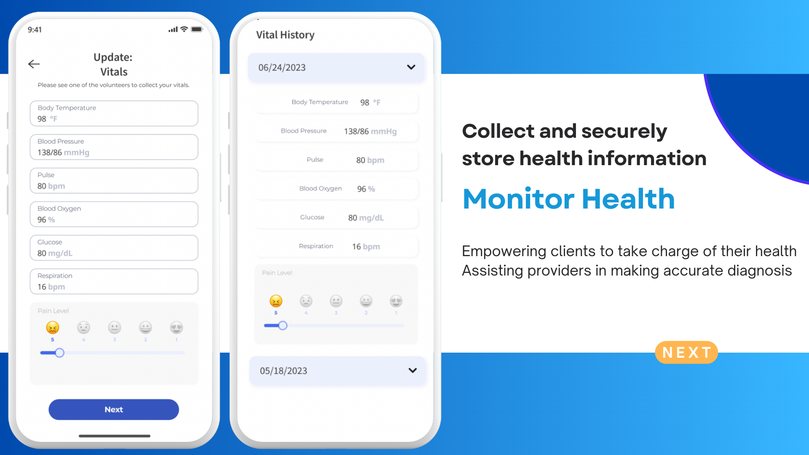
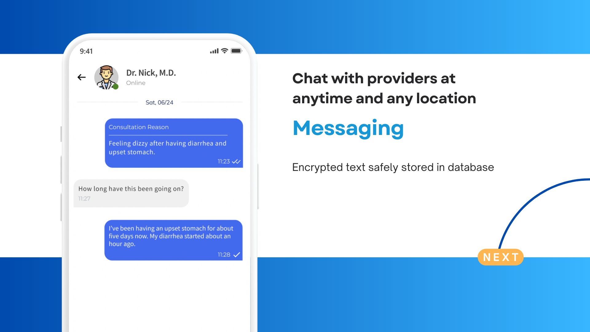

# Pocket Health

## Product Preview

  
Click to See More!

## About Pocket Health

Heal in Pocket is a non-profit organization dedicated to revolutionizing medical outreach through the development and deployment of a free electronic health record (EHR) mobile application. Our mission is to bridge the gap in healthcare access for underserved populations by providing a user-friendly, secure, multilingual, and efficient tool for medical outreach teams. The platform will be designed in collaboration with a medical advisor, Dr. Aram Harijan, and beta-tested at Street Corner Care, a homeless outreach program under the First Presbyterian Church of San Diego. Heal in Pocket will not only streamline medical recordkeeping but also offer a free telehealth feature in multiple languages, enabling and empowering remote underserved communities to connect with healthcare providers. By leveraging technology to improve the accessibility and availability of healthcare, we aim to transform traditional medical outreach into online medical outreach, promoting healthcare equity for all.

